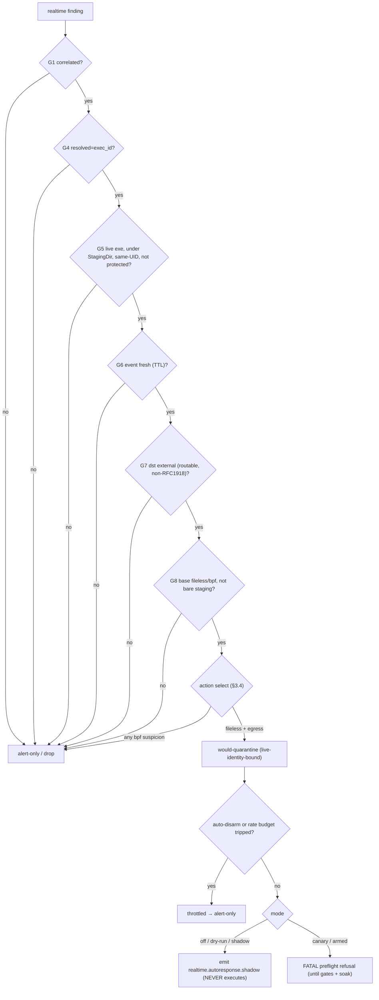
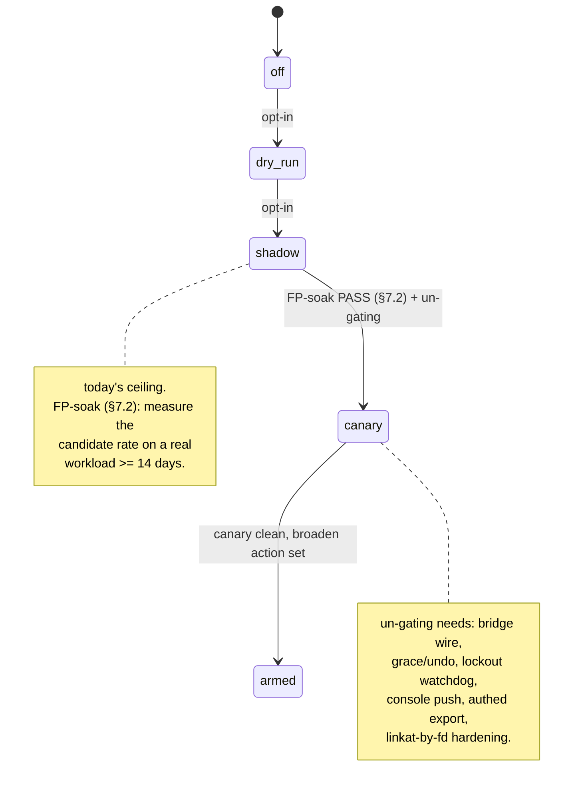

# Phase 4 — Auto-Response Design (hardened)

Status: **Proposed (decision-ready).** Audience: one human approver + one build agent.

Auto-response is the first capability in the defensive suite that takes **destructive
action with no human in the loop**. This document specifies what it may do, the rails
that make that safe, the adversary it must survive, and the staged rollout that earns
each increment of trust. It is grounded entirely in the real code; every claim below
cites the actuator, guard, signal, or pipeline that backs it.

Grounding (live mirror, read-only): `/tmp/defensive-suite.jZcb38/agent/internal/`
— `respond/{executor.go,guard.go,responder.go,respond.go,audit.go}`,
`correlate/correlate.go`, `report/report.go`, `tetragon/events.go`, `main.go`.
The working tree at `/Users/max/Documents/Claude/Projects/mtclinton/defensive-suite/`
is where new files land.

---

## Red-team hardening note (read first)

This design was **adversarially reviewed** by a red team that filed 29 findings (8
blockers + 21 majors/minors) against the v0 draft. The v0 draft made three load-bearing
claims that **do not hold against the real code** and that this revision retracts:

1. *"Quarantine is safe because the target is derived from the finding."* — False:
   `Finding.Path` is **copied verbatim from the attacker-influenced Tetragon exec event**
   (`correlate.go:351` ← `st.binary`/`ev.Binary` ← `p.Binary`, `tetragon/events.go:276`).
   It is **not** host-trusted. (Blocker #1.)
2. *"Reuse `Responder.Respond` verbatim; no execution-path change."* — False: the existing
   `Responder` has a **single, Responder-level `DryRun` bool** (`responder.go:26`, read
   unsynchronized at `responder.go:140-180`), so one shared responder cannot run quarantine
   live while every other action stays dry. Per-action arming **requires a real change**.
   (Blocker #8.)
3. *"Corroboration == external egress (the C2/exfil shape)."* — False: `correlateEgress`
   fires on **any** `connect` with **no destination class filter** (`correlate.go:291-339`);
   `dst="an external endpoint"` is only a fallback **label** for an empty dst
   (`correlate.go:323-324`), not a filter. (Blocker #5.)

The 8 blockers this revision resolves (one line each):

| # | Blocker | Resolution in this doc |
|---|---------|------------------------|
| #1 | Quarantine of attacker-controlled `Finding.Path` | §3.2/§4.2 — bind to **live process identity** (exec_id + `/proc/<pid>/exe` + starttime) **and** require resident **under a StagingDir**, acted-on by fd; `Path` string is never trusted. |
| #2 | Auto-flood trips the **shared** kill-switch, killing manual `/respond` | §4.5 — flood latches an **auto-only** disarm (`/run/agentd/autoresponse.disabled`, auto-expiring); shared kill-switch stays operator-only; storm-trip needs a **human-distinguishable** signal, not 3/300s. |
| #3 | "Shared responder" not buildable; unaudited action or detector panic | §4 / §6 — explicit **lifecycle refactor**: hoist responder+auditFile above both `startResponse` and the tail loop; decouple `auditFile.Close`; `recover()` the tail callback; fail-closed when audit unavailable. |
| #4 | Kill-switch trip = attacker-reachable global disarm | §4.5 — same as #2: **never** trip the shared switch from an auto counter; auto-only latch auto-expires. |
| #5 | Signal is "ran from /tmp AND opened any socket", not C2 | §3.1 **gate G7** — dst must be routable / non-loopback / non-RFC1918-CGNAT-link-local / non-collector / non-mgmt; empty dst → **alert only**. |
| #6 | G4 (exec_id-not-pid) is untestable — no marker on the wire | §3.1 G4 / §6 — `correlateEgress` sets a `resolved=exec_id\|pid` marker at the `resolve()` call site; bridge **refuses** findings lacking `resolved=exec_id`. |
| #8 | One shared `Responder` cannot do per-action live/dry | §4.4 / §6 — **real refactor**: per-`Request` `Mode`/`DryRun` field threaded through `Respond` **OR** two Responders sharing Executor/AuditLog/kill-switch/**one** rateLimiter. The "verbatim/unchanged" claim is dropped. |
| #15 | Hook-in feeds a responder that may not exist (`ResponseSocket==""`) | §6 — auto path **requires** a constructed responder; degrades to `MODE=off` (alert-only) when `ResponseSocket` is unset; `MODE≥canary` with no responder is a **fatal preflight error**, never a silent no-op. |

(#4 and #16 are the same trip-the-shared-switch defect from two angles; both resolved by
the auto-only latch in §4.5.) Findings #7, #9–#14, #16–#24 (majors/minors) are folded into
the sections noted inline; the 5 "already-addressed" findings (#25–#29) are re-verified and
tightened in §5/§4. **Default posture throughout: dry-run by default, least-destructive
reversible action, alert-only unless every gate passes.**

---

## 1. Goal & non-goals

### Goal

When the suite produces its single highest-trust signal — a **corroborated
exec→egress chain** (`Check == "realtime.correlated"`, `Severity == Critical`,
`Confidence == "high"`) that **also** passes the destination-class and live-identity
gates of §3 — automatically take the **least-destructive, reversible, forensic-preserving**
containing action, bound to the **live process identity**, and notify a human with a
one-click undo. Auto-response feeds the existing kernel-validated `Responder.Respond`
pipeline so it inherits every brake the manual path already has — but it does so through a
**named lifecycle refactor and a real per-action arming change** (§4.4, §6), not a
"verbatim, unchanged" reuse.

### Non-goals

- **Not** a general policy engine. Auto-response keys on exactly one signal
  (`realtime.correlated` + high) **plus** the §3 gates. Base findings (`realtime.exec`,
  `realtime.bpf`, fileless) are alert-only; they cannot trigger an auto-action.
- **Not** a replacement for manual response. The manual unix-socket responder
  (`startResponse`, `main.go:350`) remains the human's primary tool and is **never**
  disarmed by an auto-path event (§4.5).
- **Not** a re-implementation of the actuators or guards — but it **does** add: the
  per-action arming change to `responder.go` (§4.4), a `resolved=` marker and event `Time`
  in `correlate.go` (§6), reverse-actuator Actions (`unquarantine`/`de-isolate`/`restore-key`,
  §4.6), and an agentd→console push channel (§4.6). These are explicit build items, not
  hand-waves.
- **Not** "fire everything." Irreversible (`kill`) and high-blast (`isolate`,
  `revoke-key`, `block-hash`) actions are off by default behind per-action opt-ins; several
  never auto-fire at all in v1.
- **Not** armed on day one. Auto-response ships **off and dry-run by default** and is
  promoted up a measured ladder (§7) gated by an FP soak (§7.2).

---

## 2. Why this is dangerous — the weaponization threat to the feature itself

A detector that only observes is, at worst, wrong on a dashboard. A responder that acts is
a **remotely-triggerable actuator on a production host**, and the trigger is derived from
attacker-influenced inputs. The danger is not "the feature misbehaves"; it is "the
adversary turns the defender into their weapon." Six concrete abuse paths drive the design:

1. **DoS-via-defender.** The base rule arms on a process exec'd from a staging dir
   (`/tmp`, `/dev/shm`, `/var/tmp` — `StagingDirs`) that then connects out — exactly the
   benign developer/CI population, and trivially producible on purpose. Critically,
   `Finding.Path` is **the attacker's own exec string** (`p.Binary`,
   `tetragon/events.go:276`), so a forged or merely *placed* file lets an attacker steer
   what gets quarantined (abuse #1, #9).

2. **Brake exhaustion → manual disarm.** `correlateEgress` latches per `(exec_id, dst)`
   (`correlate.go:331`), so a shell loop exec'ing a **fresh** `/tmp` binary (new exec_id)
   and dialing a **fresh** dst each iteration produces **unlimited distinct** correlated
   findings for free — none deduped. Three in 300s would exhaust a `3/300s` auto budget.
   The v0 reflex — *trip the shared kill-switch on exhaustion* — would then disable the
   operator's **manual** `/respond` during the real intrusion (`responder.go:158` refuses
   **all** response). That is the inverse of safety (abuse #2, blockers #2/#4/#16).

3. **Signal spoofing / replay.** The correlation is built from Tetragon's JSON event
   **file** (`cfg.TetragonLog`, from `AGENT_TETRAGON_LOG`/`-tetragon-log`, `main.go:191,199`),
   tailed with no authentication on the input. `exec_id` is an identifier, not an
   unforgeable token. Anyone who can write that file (or repoint the path / win a rotation
   race) can synthesize an exec + a connect naming a victim. The `pidIndex` fallback
   (`correlate.go:378-382`) makes a forged connect targetable by raw PID alone (abuse #3).

4. **PID-reuse / TOCTOU.** The signal's PID/path was valid when the connect was observed;
   by the time the poll-based tailer (`time.Second` ticks, `main.go:332`) routes it, the
   PID may have been reused and the path swapped. `RealExecutor.kill` runs
   `syscall.Kill(pid, SIGKILL)` on a bare integer (`executor.go:126`) and is irreversible
   (`Undo == ""`, `executor.go:134`); `quarantine` does `os.Rename` on the **lexical**
   path (`executor.go:193`) (abuse #4, #17).

5. **Action backfiring.** `isolate` installs a host-wide nft egress drop keeping only
   `lo + MgmtIfaces` (`executor.go:158`); a misconfigured `MgmtIfaces` locks the operator
   out and **blinds the agent's own collector telemetry** — the known **M3 self-lockout
   class**. Quarantine of a load-bearing file (`os.Rename` → `chattr +i` → `chmod 000`,
   `executor.go:193-208`) **physically moves** it and can break a running service (abuse #5).

6. **Correlation-state eviction / signal suppression.** The correlator caps state at
   `DefaultMaxProcs=4096` and evicts oldest-by-`lastSeen` on admit (`correlate.go:208-228`).
   An attacker who floods 4096+ fresh exec_ids can **evict the procState of a real
   suspicious process before its connect arrives**, so the real intrusion silently never
   correlates and never reaches the auto path at all. Every gate and brake lives
   **downstream** of correlation; none defends the *production* of the finding (abuse #6,
   finding #19). Mitigation: pin/protect procStates that already carry a suspicion (evict
   clean states first), make the cap per-UID or raised, and treat sustained admit/evict
   churn as itself a High finding. The §7.2 soak measures false **positives**; it says
   nothing about attacker-induced false **negatives** — call this out in the runbook.

The governing principle: **the only auto-eligible signal is the corroborated one that
*also* names an external destination and a still-live, staging-resident process whose
identity the kernel can corroborate; and the only auto-LIVE action is reversible,
forensic-preserving, and bound to that live identity.** Everything else degrades to
alert-only, stays manual, or is opt-in behind its own switch.

---

## 3. Trigger + action policy

The decision funnel — a finding must pass every gate, then action-select, then the brakes
and the mode gate; in this build the path always ends at *shadow* (emit, never execute) or a
*fatal refusal* for canary/armed:



### 3.1 Trigger gate — all conditions AND-ed (with an honest account of which are independent)

An auto-action is *considered* only when **every** predicate holds:

| Gate | Predicate | Why (grounded) |
|---|---|---|
| **G1 Corroboration** | `Check == "realtime.correlated"` | The signal that fuses a suspicious exec/bpf-load with a subsequent egress from the same process (`correlate.go:346-366`). **This is the load-bearing gate.** |
| **G2 Confidence** | `Confidence == "high"` | **Honesty note:** `correlateEgress` sets `Confidence:"high"` unconditionally the instant it sets `Check` and `Severity:Critical` (`correlate.go:347-353`). **G1, G2, G3 are the SAME code-enforced bit** — not three independent layers. Worse, `Confidence=="high"` is *also* reachable on **plain base findings** via `bumpConfidence` when a (self-induced) ancestor was flagged (`correlate.go:459-466`, `annotateAndArm:275-277`). **Therefore auto-eligibility MUST require `Check=="realtime.correlated"` and must NEVER be reduced to a confidence check.** A code comment/invariant at the bridge enforces this. (#12, #28.) |
| **G3 Severity** | `Severity == Critical` | Same bit as G1/G2; asserted defensively, not counted as independent. |
| **G4 exec_id-resolved** | the finding carries `resolved=exec_id` in `Related` (set inside `correlateEgress` at the `resolve()` call site), **not** `resolved=pid` | Today `resolve()` (`correlate.go:372-384`) silently merges the exec_id lookup and the pidIndex pid-only fallback into a **byte-identical** finding, so a forged pid-only connect is indistinguishable from a real one — G4 is currently **untestable**. **Build prerequisite (#6):** add the `resolved=` marker; the bridge **refuses** (alert-only) any finding lacking `resolved=exec_id`. Preferred: a `resolveStrict` for the auto path that drops the pidIndex fallback entirely. Until the marker ships, auto stays at **shadow** at most. |
| **G5 Live, staging-resident, identity-bound target** | the chosen action's target is the **open `exe` of a still-live process** matching the captured `(exec_id, /proc/<pid>/exe, starttime)` **AND** resident **under a configured `StagingDir`** | The single constraint that collapses the DoS-via-defender surface (§3.2, §4.2). A finding's `Path` string is **never** the target; it is corroborated against live `/proc`. |
| **G6 Freshness (event-time) + dedup** | event `Time` is within `AutoStaleTTL` (default 5s) **measured against the Tetragon event time, not receipt time** | **Honesty note (#18):** `report.Finding` has **no time field** today and `Line()`/`Process()` don't stamp one; the only clock the auto path sees is wall-clock-at-`Consider`. Measured from receipt the TTL is theater (a stale event that sat in the poll/flush pipe still looks "fresh"); measured from event-time it is unimplementable **without** threading the Tetragon event `Time` into the finding (§6). **G6 therefore requires that plumbing.** Note also that G6's dedup **duplicates** the correlator's own `(exec_id,dst)` latch — it is not independent selectivity. |
| **G7 Destination class (NEW — blocker #5)** | `ev.Dst` is **routable, non-loopback, non-RFC1918/CGNAT(100.64/10)/link-local(169.254/16,fe80::/10), non-collector, non-mgmt-subnet**, parsed from `ev.Dst`. Empty / `"an external endpoint"` / unparseable dst → **ALERT only, never auto-act** | `correlateEgress` does **zero** address-class filtering (`correlate.go:315-325`); `egressFuncs` (`tetragon/events.go:239-244`) normalizes any connect with no check. Without G7, "corroboration" is "ran from /tmp AND opened *any* socket" — go-test binaries dialing 127.0.0.1, pip/npm hitting a registry, language servers on localhost, a container runtime dialing a LAN registry. G7 is the line between the C2/exfil shape (T1071/T1041) and "any program that opened a socket." **Note:** the VM-test dst was `127.0.0.1`, which G7 correctly makes **ineligible** — that test exercises detection, not auto-action. |
| **G8 Base-technique selectivity (NEW — #12)** | the base technique is **fileless (T1620)** or **bpf-load High** — **NOT** a bare staging-dir `realtime.exec` (T1059, scored only **Medium**) | The bare `/tmp`-exec is the cheapest-to-forge, highest-FP arming path. Requiring a fileless/bpf base for auto-eligibility removes it. (Resolves Open Q on corroboration strength toward "staging-dir-only does NOT auto-act.") |

**Honest selectivity summary.** Of the gates above, G1/G2/G3 are **one** condition, and
G6's dedup duplicates the correlator latch. The *real* selectivity over the benign
population comes from **G4 (exec_id, not pid), G5 (live + staging-resident + identity-bound),
G7 (external dst), and G8 (fileless/bpf base)**. The v0 "six independent AND-ed predicates,
defence in depth" framing overstated the bar; this is the corrected account.

### 3.2 The load-bearing target constraint — bind to live identity, never to `Finding.Path`

`report.Finding` (`report.go:88-98`) carries `Check, Severity, Title, Detail, Path,
Technique, Sigma, Confidence, Related`. It carries **no PID, no exec_id, no time, no
interface**. The correlated finding sets `Path = binary` (`correlate.go:351`) where
`binary = st.binary` (falling back to `ev.Binary`) — i.e. **`p.Binary` from the Tetragon
exec event** (`tetragon/events.go:276`). **`Finding.Path` is attacker-influenced, not
host-trusted.** A forged log line naming `binary=/opt/myapp/bin/server` produces a
`realtime.correlated`/Critical/high finding whose `Path` is a load-bearing production file;
the v0 §4.2 "realpath still matches what was flagged" check is **circular** (for a forged
finding naming a legit file, the realpath *is* that legit file).

So the bridge **never acts on the `Path` string as a target.** It binds the action to the
**live process identity** captured at detection on the tail goroutine:

- At `Consider()` time (tail goroutine), capture into immutable `Request.Args`: the
  connecting process's `exec_id`, its `/proc/<pid>/exe` realpath, its `/proc/<pid>/stat`
  starttime (field 22), its UID, and the event `Time`.
- At execution time, require the file to be quarantined to be the **open `exe`** (or
  `argv[0]` realpath) of a **still-live** process whose `(exec_id, starttime)` match, **and**
  whose realpath is resident **under a configured `StagingDir`**. Refuse otherwise.
- Resolve and act **by fd** (`O_NOFOLLOW` open + `fstat`, act on the fd) so the file checked
  is the file acted on — closing the TOCTOU split between an AutoGuards realpath check and a
  lexical `os.Rename` (#17). **Implementation status (increment 2):** the staged `quarantineFD`
  opens `O_NOFOLLOW` + `fstat`, renames, then re-`fstat`s the moved inode and compares `(Ino,Dev)`
  (`confirmMovedInode`, rolls back on mismatch). This catches a *different-inode* swap but **not
  inode REUSE** (a number-compare residual). **Deferred-before-live hardening:** `linkat(AT_EMPTY_PATH)`
  from the held fd into the quarantine dir (links the EXACT validated inode; immune to reuse;
  Linux-only, needs `CAP_DAC_READ_SEARCH`). Acceptable as best-effort only because the actuator is
  STAGED (never auto-fired) until canary.
- **Refuse any quarantine of a path outside `StagingDirs` on the auto path.** A forged
  finding naming `/opt/...` no longer matches a staging-resident live process, so the
  "quarantine an arbitrary legit file" surface collapses.

The path denylist (`CriticalPaths`, `guard.go:95-119`) is only a **backstop**, never the
primary control. Targets the finding does **not** hold are out of the auto path entirely:

- `kill` needs a numeric PID — the finding has none on the wire; **never auto-live in v1**.
- `isolate` needs an **interface** and installs a **host-wide** drop (`executor.go:138-181`),
  not a per-`dst` rule; the finding's `dst` is **evidence, never an actuator argument**.
- `quarantine` is the only v1 auto action, and its target is the live-identity-bound inode,
  **not** `Finding.Path`.

### 3.3 Finding → confidence → action map

Default action for an auto-eligible finding: **quarantine the live, staging-resident,
identity-bound binary and notify** — reversible, forensic-preserving. The action is selected
from the **full SET of base suspicions with precedence** (not `suspicious[0]`): see §3.4.

| Auto-eligible finding | Confidence | Default AUTO action | Target source | Live by default? | Reversible? | Rationale |
|---|---|---|---|---|---|---|
| `realtime.correlated`, high, base **fileless (T1620)** → external egress, **no bpf suspicion present** | high (correlated) | **quarantine** (live-identity-bound) + notify | live `/proc/<pid>/exe` (G5), **not** `Finding.Path` | **No — dry-run** until per-action arming (§4.4, §7) | **Yes** — `chattr -i && mv` back (`executor.go:209`; `plannedUndo`) **routed through a structured reverse Action** (§4.6) | Denies on-disk re-exec / persistence and preserves the sample. Bound to live identity + StagingDir + fd (§4.2). |
| `realtime.correlated`, high, **any bpf-load suspicion present** (T1014/bpf) | high | **alert-only** (recommend isolate to operator) | n/a | n/a | n/a | The binary is the loader; quarantining it does not unload a resident eBPF program — theatre. **Precedence (§3.4): bpf-load present → force alert-only regardless of any co-present staging suspicion.** |
| `realtime.correlated`, high, base bare **staging exec (T1059, Medium)** only | high | **alert-only** | n/a | n/a | n/a | **G8** excludes the bare staging exec from auto-eligibility (cheapest-to-forge, highest-FP). |
| **isolate** (host-wide egress cut) | n/a | **alert-only / opt-in only** (§4.3, §7) | a single egress iface, never a mgmt iface | **No** (off by default) | Yes (`nft delete table`, `executor.go:173`) but the *effect* is host-wide outage | M3 lockout class. Eligible for auto only behind explicit opt-in **plus** the §4.3 live-SSH-lifeline preflight and `ct state established,related accept` (a precondition, not "later hardening"). |
| **kill** (SIGKILL) | n/a | **alert-only / manual** | needs a PID; finding has none | **Never auto-live in v1; config-unreachable until identity fields ship** | **No** (`executor.go:134`) | Irreversible **and** not target-derivable. Reachable only after typed identity fields (§4.2, #27) land and a test proves `executor.kill` refuses on starttime/exe mismatch. |
| **revoke-key** | n/a | **alert-only / manual** | n/a | **Never auto-live in v1** | Partial (`.dsuite.bak`, `executor.go:227-251`) | An FP severs a legitimate operator's key; the egress signal says nothing about which key. |
| **block-hash** | n/a | **alert-only / manual** | `Path` exists but no sha256 is on the wire | **Never auto-live in v1** | Yes (`executor.go:275`) | A global fapolicyd execute-deny is host-wide; the finding carries no hash. |

**Why reversible/forensic-preserving wins.** A wrong **quarantine** of a *truly staged,
non-load-bearing* binary costs a reverse Action and an annoyance. A wrong **kill** loses
work and volatile evidence and cannot be undone. A wrong **isolate / block-hash /
revoke-key** is a host or identity outage. Auto-response spends the system's own judgement
only where the worst case is cheap and undoable — and the §4.2 live-identity + StagingDir
binding plus the §4.1 live-writer refusal keep even a wrong quarantine from being a load-bearing
outage.

### 3.4 How `Related` is used (parsed, not trusted as a target) — and action selection

- `base: <reason>` + **all** `base technique=Txxxx` lines → select the action by the **SET**
  of suspicions with **documented precedence (#24):** *if any suspicion is bpf-load → force
  alert-only*, regardless of a co-present staging suspicion. **Do not** key off
  `suspicious[0]` / the primary technique alone: `addSuspicion` accumulates a multiset
  (`correlate.go:91-101`) and `correlateEgress` picks `suspicious[0]` or the first exfilish
  entry (`correlate.go:305-313`), so an attacker who records a staging suspicion *first* and
  *then* loads eBPF would otherwise get the finding classified as staging-exec and
  auto-quarantined — quarantining the loader while the resident eBPF program runs. The bridge
  therefore inspects **every** `base technique=` line and degrades to the least action if any
  suspicion is in the alert-only class.
- `resolved=exec_id|pid` → **G4** (§3.1).
- `dst=<ip:port>` → parsed for **G7** (§3.1), recorded into `Request.Reason`, the
  notification, the audit line, and dedup. **Evidence, never an actuator argument.**
- `lineage: …` and `ancestor previously flagged suspicious` → **informational only** for the
  operator notification and audit `Reason`. The auto path derives its target from the
  connecting process itself and **never tree-kills / kills the lineage root** (abuse #1).
  **Honesty note (#28):** `ancestor previously flagged` is **attacker-self-inducible**
  (`bumpConfidence` escalates base findings via lineage), so it must never *raise*
  auto-eligibility — it only enriches context.

---

## 4. Safety rails

Architecture: auto-response is a **separate policy layer** (`internal/respond/auto.go` +
`internal/respond/autoguards.go`) that produces `respond.Request`s and feeds them through a
responder built by an explicit lifecycle refactor (below). It gets no own execution path,
but the per-action live/dry control surface **requires a real change** (§4.4) — the v0
"verbatim, unchanged pipeline" claim is **retracted**.

### 4.0 Responder lifecycle refactor (blockers #3, #8, #15)

The v0 claim "feed the same `*respond.Responder` built in `startResponse`" is **not
buildable** against the real code, and the refactor is exactly where a self-DoS hides:

- `startResponse` (`main.go:350`) builds `r` as a **function-local**, only when
  `cfg.ResponseSocket != ""` (`main.go:316`); the tail loop (`main.go:332-334`) has **no
  reference** to it and calls `corr.Line(line)` (a wrapper over `Correlator.Process`).
- `auditFile.Close()` runs **inside the serve goroutine** on `ctx` end (`main.go:412`). If
  the tail goroutine calls `Respond` after that close, `AuditLog.write`'s nil/closed-guard
  makes audit writes silently no-op → **destructive auto-actions run UNAUDITED**.
- A `nil` responder in the tail callback (when `ResponseSocket==""`) would **panic the single
  `TailWithState` goroutine**, killing **all** detection — the panic is uncaught.

**Explicit refactor (build item):**

1. **Hoist** responder + `auditFile` construction in `cmdRun` **above both** `startResponse`
   and the tail loop, so both close over the same `*respond.Responder`. `startResponse`
   becomes "serve the already-built responder on the socket."
2. **Decouple** `auditFile.Close()` from the serve goroutine: close it at the **top level on
   `ctx.Done()`**, after **both** consumers (serve goroutine + tail loop) have stopped.
3. The auto path **requires** a constructed responder. When `ResponseSocket` is unset there
   is still a responder built for the auto path; but if auto is **off** the cost is nil. When
   `MODE≥canary` **and** the prerequisites for a live responder are absent, this is a **fatal
   preflight error** (#15) — *auto-response that silently does nothing is worse than one that
   refuses to start.*
4. **`recover()`** the entire per-line tail callback: a panic in `corr`/`autoresp` logs +
   emits a finding but **never** kills `TailWithState`.
5. **Fail-closed when audit is unavailable:** if the audit writer cannot be written, the auto
   path **refuses** (does not run). Add a test asserting this.

### 4.1 Never-touch + live-writer refusal (auto superset of the manual guards)

Manual guards refuse only: `kill` PID≤1 / `SelfPID`; `isolate` of a `MgmtIfaces` member;
`quarantine` under `CriticalPaths` / `/` / `/lib*` — **lexical-prefix only**
(`guard.go:64-120`). That is the floor; it does **not** cover `/opt`, `/srv`, operator data
dirs, or symlinks. Auto adds `AutoGuards`, resolving identity against live `/proc` at
request-build time:

- **Path self-protection (backstop).** Refuse to quarantine a realpath that is the agentd
  binary, the collector binary, `sshd`, the operator's login shell, any configured
  protected-unit binary, or the open `exe` of any never-touch PID. **This is a backstop, not
  the primary control — the primary control is the §4.2 live-identity + StagingDir bind.**
- **`AGENT_AUTO_NEVER_QUARANTINE` (#17).** Operator-extendable denylist of protected **data**
  dirs (mirrors `AGENT_AUTO_NEVER_KILL`), extending the never-quarantine set beyond system
  dirs to `/opt`, `/srv`, `/usr/local`, mounted volumes, and any systemd unit's `ExecStart`
  target.
- **Live-writer / live-exec refusal (#14, #9, #26).** Refuse auto-quarantine (degrade to
  alert) when `/proc/*/maps` or `/proc/*/fd` shows the path **open-for-write or
  open-for-exec/mmap'd by any process the EDR did not itself flag** — not just
  "protected/critical." The correlating connect frequently fires *during* the tool's run, so
  the target is often a binary mid-execution; yanking + locking it (`os.Rename` →
  `chattr +i` → `chmod 000`) breaks the running build/service before any human sees the
  notification.
- **Same-UID requirement (#9).** Refuse to quarantine any path **not owned by the same UID as
  the connecting process**, and any path in a world-writable dir also open/expected by a
  process of a different UID. Prefer to quarantine the **specific inode the suspect process
  exec'd** (captured at detection, acted-on by fd), not "whatever now lives at this path," so
  a swapped-in legit file is not actioned.
- **Build-temp negative heuristic (#13).** Refuse auto-quarantine when the realpath matches
  build/CI churn patterns (`/tmp/go-build*`, `/tmp/pip-*`, `/tmp/cargo*`, `*.tmp`) or is held
  by a build toolchain in the operator's session; require the staged binary to be
  **non-transient** (held by a long-lived non-build process) at execution time.
- **UID / session / interactivity heuristic (#22).** UID is available end-to-end
  (`tetragon/events.go:277`; `rules.execDetail` prints `uid=%d`), yet the v0 design used
  **neither** UID, controlling-tty, nor operator-session as a trust input — leaning entirely
  on path (`/tmp`) + connect, the two most benign-saturated dimensions, and treating the
  operator's own interactive `/tmp` test binary identically to a daemon-spawned `/tmp`
  dropper. The single cheapest FP discriminator on a dev workstation is "is this the live
  operator's own interactive login session." **Thread UID** (and, via `/proc` at
  request-build time, controlling tty / session leader) **into the captured snapshot**, and:
  a `/tmp`-exec+egress originating from the **live operator's own interactive login session**
  is **alert-only**; auto-eligibility weights toward **non-interactive / unexpected-UID
  origins** (an unprivileged service account or a process with no controlling tty — the more
  malicious population). Make it config-tunable (mirror `StagingDirs`/`AutoNeverKill`) so the
  workstation's dominant FP source becomes a discriminator rather than a blind spot.
- **Static never-kill set (later kill rung).** Resolve a candidate PID via `/proc/<pid>/...`
  and refuse PID 1/2 + kernel threads, agentd + its tree, the collector, `sshd` and any PID
  in the live operator's SSH session/pgroup, systemd + its managers; operator-extendable via
  `AGENT_AUTO_NEVER_KILL`.
- **Never-revoke for auto** — `authorized_keys` of root and the live operator (stricter than
  the manual guard). Moot in v1.
- **Fail toward refuse.** When identity resolution is uncertain, refuse (or degrade to the
  reversible action), never escalate.

### 4.2 Identity-bound action (defeats spoofing + PID-reuse + DoS-via-defender)

- **Quarantine (v1).** Bind to live identity per §3.2: capture `(exec_id, /proc/<pid>/exe
  realpath, starttime, UID, event Time)` at `Consider()` time; at execution re-resolve and
  require a **still-live** process matching `(exec_id, starttime)`, its `exe` realpath
  **under a StagingDir**, owned by the connecting UID, then **open `O_NOFOLLOW` and act by
  fd** (close the check-vs-act TOCTOU). Refuse on any mismatch. **Honesty note (#27):**
  `report.Finding` carries none of these fields today; this requires typed
  `ExecID/Pid/StartTime/DetectedAt` (or an `AutoMeta` struct) threaded from `correlate.go`
  through the `corr.Line` wrapper (`main.go:333`) into `Request.Args`. That plumbing is a
  **hard precondition**, not prose.
- **Kill (later rung only).** Identity-bound via starttime/`exec_id`, or `pidfd` opened at
  detection + `pidfd_send_signal`. **The kill rung is config-unreachable** until the typed
  identity fields ship **and** a test proves `executor.kill` **refuses** on exe/starttime
  mismatch (#27). A forged finding naming `sshd` will not match an attacker's `/tmp` stager's
  `/proc/<pid>/exe`, and the kill is refused.

### 4.3 Self-lockout prevention (the M3 lesson, generalized) — gate auto-undo on a POSITIVE lockout signal (#10)

Single invariant: *an auto-action must never sever a path the operator/agent needs to
observe or reverse the incident.*

- **Isolate** reuses the M3-fixed `executor.isolate` (keeps `lo + MgmtIfaces`,
  `executor.go:158`) and adds, **as preconditions of arming isolate, not "later hardening":**
  (a) a `ct state established,related accept` rule installed **before** the drop so inbound-SSH
  return paths survive regardless of `oifname`; (b) a live-SSH-lifeline preflight — resolve the
  operator session's socket → its `oif`; if isolate would drop the iface the live SSH is on,
  **refuse.**
- **Auto-undo is gated on a POSITIVE self-lockout signal, NOT mere collector-unreachability
  (#10).** The v0 "auto-undo if the collector heartbeat fails" tears down legitimate
  containment during the exact incidents isolate exists for (a real intrusion / the
  attacker's own actions / a WAN flap commonly make the collector unreachable), and the v0
  pairing of auto-undo **with a kill-switch trip** hands the attacker a combined
  *uncontain + disarm* primitive. Instead: **only auto-undo when the OPERATOR's live access is
  severed** — `/run/agentd/response.sock` reachability lost **and/or** the operator session's
  `oif` is down. Collector-unreachable alone does **not** trigger undo. **Verify the `nft`
  undo succeeded** (it shells out best-effort, `executor.go:173/290`, and can fail leaving a
  half-isolated host) and **alert loudly on undo failure** instead of assuming
  reversibility. **Do not couple auto-undo to a kill-switch trip.**

### 4.4 Per-action arming — the REAL change (blocker #8)

The existing pipeline **cannot** express per-action arming from a shared responder: `DryRun`
is a single Responder-level bool set once in `NewResponder` (`responder.go:26,48`) and read
**unsynchronized** in `Respond` (`responder.go:140-180`) while both the tail goroutine and the
manual-socket goroutine call `Respond` — flipping it per-action is a **data race**. Pick one:

- **(a) Per-`Request` mode.** Add a `Mode`/`DryRun` field to `Request` and thread it through
  `Respond` (read the request's mode, not `r.DryRun`). This is a **real, audited change to
  `responder.go`** — the "verbatim" claim is dropped. OR
- **(b) Two Responders.** Build two `*respond.Responder` sharing the **same** `Executor`,
  `AuditLog`, kill-switch path, and **one** `rateLimiter` instance: one live-for-armed-actions,
  one dry for the rest; `autoresp` routes per action. **The manual and auto responders must
  share one `rateLimiter` pointer or the "separate budgets / can't starve manual" claims both
  fail** — see §4.5 for the correct budget topology.

Two **independent** mode switches, so arming *manual* live response does not silently arm
*auto*:

| Setting (env) | Default | Effect |
|---|---|---|
| `AGENT_AUTORESPONSE_MODE` | `off` | Auto ladder selector (§7): `off`\|`dry-run`\|`shadow`\|`canary`\|`armed:<csv>`. Unparseable → `off` (fail-safe). |
| `ResponseEnabled` (existing) | `false` | The live executor exists only when set (`main.go:372`). Auto-execute requires `ResponseEnabled=1` **and** `MODE≥canary` **and** the action in the armed allowlist; missing any → computed + notified, runs dry. |
| `AGENT_AUTO_NEVER_KILL` / `AGENT_AUTO_NEVER_QUARANTINE` | (built-in sets) | Operator-extendable never-touch denylists (§4.1). |
| `AGENT_AUTORESPONSE_GRACE` | `10s` | Grace/undo veto delay (§4.6) — **applied to quarantine too** (#14). |
| `AGENT_AUTORESPONSE_RATE` | `3/300s` | Auto's **own** rate budget (§4.5). |
| `AutoStaleTTL` | `5s` | G6 event-time staleness cutoff. |
| `AutoRollbackWindow` | (short) | Watchdog auto-undo window (§4.3, §4.6). |

### 4.5 Brakes — separate auto budget + AUTO-ONLY disarm (blockers #2, #4, #16)

- **Kill-switch (shared, operator-only).** `touch /run/agentd/response.disabled` instantly
  refuses **all** response — manual and auto (`responder.go:158`). It is the operator's panic
  button and is **NEVER** tripped by an auto-path event.
- **Auto-only disarm latch (NEW — the core fix for #2/#4/#16).** On auto-budget exhaustion or a
  detected storm, latch **only** the auto path off via a **distinct** disarm
  (`/run/agentd/autoresponse.disabled`, or an in-memory flag) that **auto-expires** after a
  window (the trigger is an attacker-controllable rate, so it must not require a human `rm`).
  **Manual `/respond` stays fully live.** Emit the High finding `realtime.autoresponse.throttled`
  **once per window (rate-limited), not per refused attempt** (#16 caps audit/journal write
  amplification). A test must assert *a simulated auto-flood does not refuse a subsequent
  manual request.*
- **Storm-trip requires a HUMAN-distinguishable signal (#2).** Do **not** trip on `3/300s` —
  a single benign CI run of `/tmp` build artifacts hits that. Trip only on a signal a human
  would call a storm: a burst across **many UIDs**, or sustained over a **long** window, or a
  distinct-resolved-target count far above the soak-measured baseline.
- **Rate limit topology.** The auto path gets its own budget *semantics* but shares the
  `rateLimiter` **instance** with manual per §4.4(b) (or, with §4.4(a), uses a clearly
  separate limiter that is documented as not affecting the manual budget). Default `3/300s`
  with per-action sub-limits. **Dedup on a STABLE attribute (#29):** key dedup/distinct-target
  on the **dst and the lineage-root exec_id** in addition to resolved binary, so a
  rename-per-exec storm (fresh `/tmp` name each exec) still collapses instead of burning one
  unit per process.
- **Latch BEFORE the gate decision is moot for action-dedup (#7).** The correlator sets
  `correlatedDsts[dst]=true` **unconditionally at correlation time** (`correlate.go:331-339`),
  **upstream of every brake and of the dry-run/shadow stages.** Consequence: a refused /
  dropped / merely-shadowed correlation **still consumes the dst** and the correlator
  **never re-emits** it — a real beacon that arrives during a flood or is rate-limited gets
  exactly one shot, then goes silent forever. **Fix (build item):** decouple
  **detection-dedup from action-dedup** — keep emitting the correlated finding per dst for the
  collector/alert path (do not let a refused/dry-run/shadow decision consume a real
  correlation), and track **action-dedup in `autoresp.go` keyed on the resolved target**, not
  in the correlator. At minimum, do not set `correlatedDsts` until after the finding has been
  delivered.
- **Audit (append-only, existing).** Every auto decision writes the two-stage `Audit.Intent` +
  `Audit.Result` (`responder.go:148-204`) with `Actor = "auto:<check>"`; refusals are audited
  too — subject to the once-per-window cap above for the throttle case.

### 4.6 Mandatory undo + notify — via FIRST-CLASS reverse Actuators (blocker-adjacent #21)

- **The v0 "one-click UNDO through the validated pipeline" did not exist (#21).** The agent
  has **no push channel** to the console (only the collector POST flush), and the inverse of
  quarantine is a **free-text shell string** (`executor.go:209`:
  `chattr -i <dst> && mv <dst> <src>`), **not** a structured `Request` — there is no
  `ActionUnquarantine`. Shelling the free-text string would **bypass Guards/kill-switch/
  rate-limit** — the opposite of the safety claim. **Build items:**
  - Add **first-class guarded reverse Actions** — `ActionUnquarantine` (by quarantine-dst),
    `ActionDeIsolate`, `ActionRestoreKey` — so UNDO is a structured `Request` that flows
    through `Validate` → kill-switch → rate-limit → audit, **not** a shelled string.
  - Add the **agentd→console push channel** as an explicit build item (it does not exist).
  - Until **both** exist, "notify-and-undo" is **not a real rail** and **canary must not be
    entered relying on it.**
- **Reversibility precondition.** An auto-action may go LIVE only if its inverse is a
  constructible reverse Action (above). `kill` (no inverse) requires its own arming + the full
  §4.1/§4.2 gauntlet + grace delay + the §3.3 config-unreachability lift.
- **Undo journal.** Append-only `auto-undo.jsonl` (sibling of the audit log) records per live
  auto-action: timestamp, the `Request`, the resolved `/proc` target snapshot, the inverse
  `Request`, and the triggering finding.
- **Notify + grace veto.** On every auto-action (dry-run included) agentd pushes an event the
  console (Tauri `tauri-plugin-notification`) renders, carrying action + target + finding
  context + the inverse Action, with **UNDO**. **Quarantine gets the `AGENT_AUTORESPONSE_GRACE`
  CANCEL window too (#14)** — the v0 "reversible → immediate, no veto" rule applied the
  no-grace path to exactly the action whose FP is armed first against paths often mid-execution.
- **Per-action human TP/FP triage (#23).** `undo_total` is a **poor FP proxy** for the canary:
  a wrongly-quarantined transient build artifact is rarely *undone* (the dev just re-runs), so
  the proxy stays near zero while the system mis-quarantines. **Require an explicit human TP/FP
  acknowledgement per live auto-quarantine within a window;** unacknowledged or FP-marked
  actions feed demote-on-anomaly. "Acted on a path that no longer exists / was a temp artifact"
  is a strong FP signal.
- **Auto-rollback** runs the journaled inverse **only** on the POSITIVE operator-lockout
  signal of §4.3 (never on collector-unreachability), and does **not** trip the kill-switch.
- **No silent action, ever.** Live auto-actions also fire the journald `crit` line and any
  configured webhook.

### 4.7 Concurrency contract (#11)

The async machinery (grace/veto queue, reachability watchdog, auto-rollback, dedup/cap
structures) introduces concurrency the codebase explicitly forbids on the correlator
(`correlate.go:103-104`: "NOT safe for concurrent use; agentd drives it from a single tail
goroutine"; `TailWithState` invokes the callback synchronously, `main.go:217-218`). Hard rules:

- The auto path reads **ONLY immutable, value-copied snapshots captured on the tail
  goroutine** (copy `exec_id`/pid/starttime/exe/path/dst/UID/Time into `Request.Args` at
  `Consider()` time). **No goroutine outside the tail may call into the `Correlator`.**
- Guard the auto path's own state (dedup set, distinct-target counter, grace queue) with its
  **own mutex** — a torn read of the dedup map or counter can **double-fire** a destructive
  action (dedup miss) or wrongly trip the cap / latch (self-DoS).
- The `rateLimiter` is the only shared mutable in `respond/` and is mutex-guarded
  (`responder.go:104-130`) — keep it that way.
- Run the suite under `go test -race` with a test firing concurrent `Consider` + watchdog +
  grace-expiry.

---

## 5. Adversary-aware failure modes + mitigations

| # | Abuse path | Likelihood / impact | Mitigation (this design) |
|---|---|---|---|
| 1 | **DoS-via-defender** — forge/place a finding to quarantine a legit file or self-isolate | High / High | **`Finding.Path` is never the target;** quarantine is bound to a live, staging-resident, identity-matched (`exec_id`+`exe`+starttime+UID) process acted-on by fd (§3.2, §4.2); refuse outside `StagingDirs`; live-writer/same-UID/build-temp refusals + `AGENT_AUTO_NEVER_QUARANTINE` (§4.1); target derived only from the connecting process, never lineage (§3.4); isolate opt-in only. |
| 2 | **Brake exhaustion → manual disarm** | High / Med-High | **Auto-only disarm latch** (auto-expiring) on exhaustion; **shared kill-switch never tripped by an auto event**; storm-trip needs a human-distinguishable signal (many UIDs / sustained), not 3/300s; dedup keyed on **stable** dst + lineage-root (§4.5). Test: auto-flood does not refuse manual. |
| 3 | **Signal spoofing / replay** — write/repoint the unauthenticated Tetragon log | Med / **Critical** | **Hardened source preflight (#20):** resolve `cfg.TetragonLog` with `O_NOFOLLOW`, require the file **and every parent dir** root-owned and not group/world-writable, **reject symlinks**, ideally verify the Tetragon unit identity; **re-stat owner AND inode on every reopen/rotation and fail the auto layer closed (alert-only) on any regression** (#25). Drop the pid-only fallback for auto (G4). **Identity-bind every action** (§4.2) so a forged victim name won't match `/proc`. **File-tail can only reach `shadow`; `canary`+ REQUIRES the gRPC/socket export with peer auth (Open Q #1 must be RESOLVED before arming).** |
| 4 | **PID-reuse / TOCTOU** | Med / High | Identity-bound action via starttime/`exec_id`/`pidfd`, acted-on by fd (§4.2); **event-time** staleness TTL (G6); kill config-unreachable until typed identity fields + a refusal test ship (#27). |
| 5 | **Action backfiring** — isolate locks out operator / blinds collector; quarantine breaks a service | Med / **Critical** | v1 default is identity-bound, staging-resident quarantine **only**; isolate behind opt-in + `ct established,related accept` + live-SSH-lifeline preflight (§4.3); **auto-undo gated on a POSITIVE operator-lockout signal, never on collector-unreachability, and never coupled to a kill-switch trip** (#10); quarantine refuses live-writer/cross-UID paths (§4.1); if the auto layer cannot trust its input it **fails safe to alert-only**. |
| 6 | **Correlation-state eviction / signal suppression** (NEW — #19) | Med / High (false-negatives) | Pin/protect procStates that already carry a suspicion (evict clean states first); raise the cap or make it per-UID; treat sustained admit/evict churn as a High finding. Documented in the §7.2 soak rationale: the measured FP rate says **nothing** about attacker-induced false negatives. |

---

## 6. Where it hooks in (for the build agent)

- **Decision point:** the run-mode per-line callback at `main.go:332-334`. Note the real call
  is `corr.Line(line)` (a wrapper over `Correlator.Process`), **not** `corr.Process` — the v0
  snippet conflated them (#27):
  ```go
  // After the §4.0 refactor: r and auditFile are hoisted; the callback is recover()-wrapped.
  _ = pipeline.TailWithState(ctx, cfg.TetragonLog, statePath, time.Second, func(line string) {
      defer recoverTail()              // §4.0: a panic here must NOT kill TailWithState
      findings := corr.Line(line)      // base + correlated findings
      buf.Add(findings...)             // existing: buffer → flush → collector
      autoresp.Consider(findings)      // NEW: gate → build identity-bound Request → r.Respond(req)
  })
  ```
- **Lifecycle refactor (§4.0):** hoist `r` + `auditFile` above both `startResponse` and the
  tail loop; decouple `auditFile.Close()` to top-level `ctx.Done()`; make
  `MODE≥canary` with no live-capable responder a **fatal preflight error**; fail-closed when
  audit is unavailable.
- **Per-action arming (§4.4):** implement (a) a per-`Request` `Mode`/`DryRun` field threaded
  through `Respond` **or** (b) two Responders sharing one `Executor`/`AuditLog`/kill-switch and
  **one** `rateLimiter`. Either way, **no second executor, no path that skips
  Validate/kill-switch/rate-limit.**
- **Correlator changes (`correlate.go`):** (1) set a `resolved=exec_id|pid` marker in
  `Related` at the `resolve()` call site, or add `resolveStrict` for auto (G4, #6); (2) thread
  the Tetragon event `Time` into the finding (G6 event-time staleness, #18); (3) add typed
  identity fields (`ExecID/Pid/StartTime/DetectedAt`, or an `AutoMeta`) so the bridge can
  identity-bind (#27); (4) decouple `correlatedDsts` action-dedup from detection-dedup, or set
  it only after delivery (#7); (5) pin suspicion-carrying procStates from eviction (#19).
- **New code:** `internal/respond/auto.go` (gate → identity-bound `Request` bridge, grace/veto
  queue, stable-key dedup + distinct-target cap, undo journal, auto-only disarm latch);
  `internal/respond/autoguards.go` (`/proc`-resolving identity guards, StagingDir/same-UID/
  live-writer/build-temp checks, protected sets). **Reverse Actuators** `ActionUnquarantine`/
  `ActionDeIsolate`/`ActionRestoreKey` in `executor.go`+`guard.go`+`responder.go`'s
  `planned`/`plannedUndo` (#21). **agentd→console push channel** (#21). New config in
  `config.go` (all default-safe; unparseable → safe/off).

---

## 7. Operational rollout



`AGENT_AUTORESPONSE_MODE` drives a **strict, monotonic, config-gated ladder.** You never jump
to `armed`; each promotion is a deliberate config change requiring the soak gate (§7.2)
satisfied for that stage's duration. **Hard arming preconditions before any live rung:** the
gRPC/socket export with peer auth (Open Q #1 RESOLVED) for `canary`+ (#20/#25); the
hardened source preflight (§5 row 3); the per-action arming change (§4.4); the reverse
Actuators + push channel (§4.6, #21); the identity-field plumbing (§4.2, #27); the
event-time + `resolved=` markers (#6/#18); the `recover()` + fail-closed-audit refactor
(§4.0). Any missing → stay at **shadow**.

### 7.1 The ladder

| Stage | `MODE` | Behaviour | Executes? | Notifies? |
|---|---|---|---|---|
| **0. Off** | `off` (default) | `autoresp.Consider` is a no-op. Pure detection. | No | No |
| **1. Dry-run** | `dry-run` | Build the `Request`, run the full pipeline `DryRun=true`; audit "would quarantine …". | No | Audit only |
| **2. Shadow** | `shadow` | Dry-run + a console notification on every action that *would* fire — operators judge each. **File-tail source caps trust here** (#20). | No | Yes |
| **3. Canary** | `canary` | **LIVE for exactly one reversible action: live-identity-bound, staging-resident quarantine with the §4.1 live-writer refusal and the §4.6 GRACE+CANCEL veto.** Every other class stays shadow. **Not enterable until all §7 preconditions hold.** | Quarantine only | Yes + UNDO (structured reverse Action) |
| **4. Broaden** | `armed:<csv>` | Explicit per-action allowlist, one at a time, re-soaked. Order: `block-hash` → `isolate` (with §4.3 preconditions) → `revoke-key` → **`kill` last** (config-unreachable until §4.2/#27 land). | Allowlisted classes | Yes + UNDO/DELAY |

Why quarantine (not isolate) is the canary: most reversible *and* forensic-preserving, target
bound to live identity with no host-wide blast, and now guarded against live-writer FPs and a
veto window. Isolate has whole-host blast + the M3 class, so it is promoted only behind the
§4.3 preconditions. `kill` is last and config-unreachable until identity-binding is wired.

### 7.2 The false-positive soak prerequisite (the hard gate)

> **Runbook:** the step-by-step procedure (enable shadow, run ≥14 days with real churn, the
> exact `jq` queries against the collector, the triage + arm checklist) is in
> [`PHASE4_FP_SOAK.md`](PHASE4_FP_SOAK.md).

**Rule: you may not promote past Shadow until you have measured the real-world auto-action
*candidate* rate on the actual workload. No measurement → no arming. Full stop.** The rate
limit and kill-switch are damage *caps*, not substitutes for knowing the FP rate. The soak
measures false **positives**; it says nothing about attacker-induced false **negatives**
(abuse #6) — that risk is mitigated separately in §2/§5.

**Measure the metric the ACTION uses, not the correlated-finding count (#13).** The
`(exec_id,dst)` latch is **per exec_id**, and every re-invocation of the same logical tool
gets a **new** exec_id (a dev running `go test` 40×/day yields 40 distinct correlated findings
against 40 timestamped temp paths). Target-dedup keyed on binary does **not** collapse these.
So count **distinct `(resolved-binary, action)` auto-action CANDIDATES/day, including
build/CI churn**, and require **zero would-be-live quarantines of any transient build/temp
artifact.** Triage every candidate TP/FP and keep the log.

| Promotion | Minimum soak | Acceptance criterion |
|---|---|---|
| Off → Shadow | 7 days | Any non-zero candidate rate is fine; purpose is to characterize. |
| Shadow → Canary (quarantine live) | **14 consecutive days** | **Zero un-triaged candidates** AND measured FP rate **≤ 1 / 30 days** on the `(resolved-binary, action)` candidate metric AND **zero would-be-live quarantines of transient build/temp artifacts.** |
| Canary → Broaden (per action) | 14 days clean per added class | Zero **human-marked-FP** auto-actions of the canary class (not zero `undo_total` — #23) AND zero `guard`-refusal events indicating mistargeting. |

Rationale for ≤ 1/30d: a wrong, identity-bound, staging-resident, reversible quarantine on a
single workstation — vetoed within the grace window or undone via a structured reverse Action
— is an acceptable monthly cost; a higher rate means the signal isn't ready and you stay in
Shadow.

### 7.3 Notify-and-undo (active in canary and above)

Per §4.6: every live auto-action pushes a console notification (via the NEW push channel)
carrying action, finding context, and a **structured inverse Action** (NOT a free-text undo
string), with one-click UNDO and the CANCEL veto during the grace window (which **now applies
to quarantine too**). **Canary must not be entered until the reverse Actuators and the push
channel exist** (#21).

### 7.4 Metrics + demote-on-anomaly

agentd emits these as Info findings on the flush heartbeat (and a `/metrics` line beside
`/healthz`), all roll-ups of the append-only audit: `autoresponse_considered_total`;
`autoresponse_actions_total{action,mode}`; `executed` vs `shadowed`; `human_fp_total` /
`human_tp_total` / `unacknowledged_total` (**the human-triage TP/FP signal is the canary FP
proxy, NOT `undo_total`** — #23); `cancel_total`; `refused_total{reason}` bucketed by which
brake fired (`guard` spike = mistargeting); `autoresponse_throttled_total`; `grace_pending`
gauge. **Demote-on-anomaly:** if `refused_total{guard}`, `human_fp_total`, or
`unacknowledged_total` crosses a threshold in a window, agentd auto-demotes one rung
(armed→shadow) and notifies.

### 7.5 Always-on fallbacks (verify each present)

Shared kill-switch (operator-only panic disarm); **separate auto-only disarm latch
(auto-expiring, never the shared switch)**; append-only audit + undo journal; metrics
heartbeat; `MODE=off`/`shadow` reachable by a single config change (detection + manual
`/respond` never affected). The hardened Tetragon-source preflight (§5 row 3), the isolate
`ct established,related` + live-SSH-lifeline preconditions (§4.3), the reverse Actuators +
push channel (§4.6), and the identity-field/marker plumbing (§4.2, §6) are **hard arming
gates**, not advice.

---

## 8. Open questions

1. **Tetragon source trust — must be RESOLVED before `canary`.** Move agentd off the file
   tail onto the gRPC/socket export with peer auth for armed deployments? The red team
   established that **file-tail input cannot meet the bar for unattended destructive action**
   (#20/#25); this is no longer "accept the file with a preflight" — it is a precondition.
2. **`pidfd` availability.** Is `pidfd_send_signal` present on the target kernels? Affects the
   later kill rung only; until then kill is config-unreachable (§3.3, #27).
3. **Per-UID correlator cap (abuse #6).** Should the `DefaultMaxProcs=4096` cap be per-UID, or
   raised, to blunt eviction-driven signal suppression — and what is the admit/evict-churn
   threshold that itself becomes a High finding?
4. **Storm signal definition (#2).** What exactly is the "human-distinguishable" storm that
   trips the auto-only latch — distinct-UID count, sustained-window duration, or
   distinct-resolved-target count above the soak baseline? Set from §7.2 data.
5. **Auto-only latch expiry.** What is the right auto-expiry window for
   `/run/agentd/autoresponse.disabled` so a flood is contained without leaving the auto layer
   needlessly disarmed?
6. **Grace-delay default.** Is 10s the right veto window for quarantine (now in the grace path)
   and the eventual kill rung against a fast exfil, or per-action?
7. **Distinct-target cap value (`K`).** Validate `3/300s` and `K` against the §7.2 soak's
   measured distinct-candidate rate before arming; document the worst-case starvation window
   as an explicit accepted risk in the runbook (#29).
